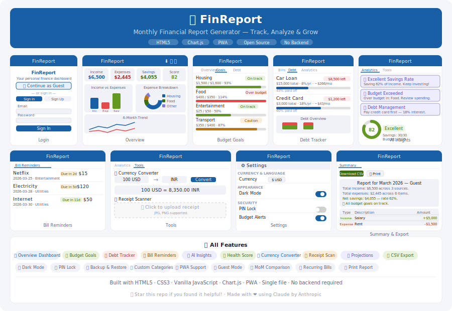

# 💰 FinReport — Monthly Financial Report Generator

> A powerful, fully offline personal finance web app. Track income, expenses, debts, bills, savings goals and more — all in one beautiful dashboard. No backend, no subscription, no login required.

<div align="center">


</div>

---

## 🌐 Live Demo

**[https://tushar763-max.github.io/Finance-Report-/](https://tushar763-max.github.io/Finance-Report-/)**
*(Replace with your actual GitHub Pages URL)*

---

## 📱 Install as an App (PWA)

FinReport works as a **Progressive Web App** — install it on your phone like a native app, for free!

**On Android (Chrome):**
1. Open your live site in Chrome
2. Tap the 3-dot menu → **"Add to Home screen"**
3. Tap **"Add"** — done! 🎉

**On iOS (Safari):**
1. Open your live site in Safari
2. Tap the **Share** button → **"Add to Home Screen"**
3. Tap **"Add"** — done! 🎉

---

## 🖼️ App Preview



---

## 🖼️ App Interfaces

### 🔐 Login Screen
The first screen users see when they open FinReport. Features:
- **Guest login** button — big, prominent, no account needed
- Email & password sign in
- Sign up with name, email, password and profile photo
- Google sign-in button (requires backend for real use)

```
┌─────────────────────────────┐
│         FinReport           │
│   Your personal finance app │
│                             │
│ [👤 Continue as Guest     ] │
│  — or sign in / create —   │
│ [ Sign In ] [ Sign Up ]     │
│                             │
│ Email:    [_______________] │
│ Password: [_______________] │
│         [ Sign In ]         │
└─────────────────────────────┘
```

---

### 📊 Overview Dashboard
The main dashboard after login. Shows:
- **4 metric cards** — Total Income, Total Expenses, Net Savings, Health Score
- **Income vs Expenses** — bar chart comparing the two with savings
- **Expense Breakdown** — donut chart showing spending by category
- **6-Month Trend** — line chart showing income and expense history

```
┌──────────┬──────────┬──────────┬──────────┐
│ Income   │ Expenses │ Savings  │ Health   │
│ $6,500   │ $2,445   │ $4,055   │ 82/100   │
└──────────┴──────────┴──────────┴──────────┘
┌─────────────────────┬──────────────────────┐
│ Income vs Expenses  │  Expense Breakdown   │
│  [Bar Chart]        │  [Donut Chart]       │
└─────────────────────┴──────────────────────┘
┌──────────────────────────────────────────┐
│           6-Month Trend [Line Chart]     │
└──────────────────────────────────────────┘
```

---

### 💵 Income & 💸 Expenses Tabs
Add and manage income sources and expense entries:
- Add entries with source/description, amount, and category
- Delete entries with one click
- Category badges for quick identification
- **Custom categories** — add your own expense categories with custom colors

---

### 🎯 Budget Goals Tab
Set and track monthly spending limits:
- Set a limit per category with a goal name
- Live progress bar showing % of budget used
- **On track** (green) or **Over budget** (red) badge
- Goal vs Actual bar chart for visual comparison

```
Housing    ████████████████░░  93%  $1,500 / $1,600  ✅ On track
Food       ████████████████████ 100% $400  / $350    ❌ Over budget
Transport  ██████████████████░░ 87%  $350  / $400    ⚠  Caution
```

---

### 💳 Debt Tracker Tab
Track all loans and credit cards:
- Add debt with name, total amount, remaining balance, and interest rate
- Auto-calculates estimated monthly payment
- Progress bar showing % paid off
- Stacked bar chart — paid vs remaining per debt

```
Car Loan     ██████████░░░░░░░░░  43% paid  |  $8,500 remaining
Credit Card  ████████████░░░░░░░  60% paid  |  $1,200 remaining
```

---

### 📅 Bill Reminders Tab
Never miss a bill again:
- Add bills with name, amount, due date, and category
- Color-coded status badges:
  - 🔴 **Overdue** — past due date
  - 🟡 **Due soon** — within 5 days
  - 🟢 **On track** — more than 5 days away
- Automatic notification on app open for bills due within 3 days

---

### 🤖 Analytics Tab
Three powerful analysis tools:

**AI-Powered Spending Insights** — personalized cards based on your data:
- Savings rate assessment
- Budget exceeded warnings
- Debt management tips
- Income diversification advice
- Investment opportunities

**Financial Health Score** — score out of 100:
| Factor | Weight | What it measures |
|--------|--------|-----------------|
| Savings Rate | 30 pts | % of income saved |
| Budget Control | 25 pts | Number of over-budget categories |
| Debt Load | 25 pts | Debt relative to income |
| Income Sources | 20 pts | Number of income streams |

**Month-over-Month Comparison** — bar chart comparing this month vs last month for Income, Expenses, and Savings.

---

### 🛠️ Tools Tab
Three utility tools:

**Currency Converter** — convert between 6 currencies using built-in rates:
- USD, INR, EUR, GBP, JPY, AUD

**Receipt Scanner** — upload a receipt photo:
- Auto-detects store name, amount, and category
- Add directly as an expense entry with one click

**Savings Projections** — compound interest calculator:
- Set annual return rate, monthly contribution, starting balance
- See projected balance at 1, 3, 5, and 10 years
- Visual 10-year growth chart

---

### ⚙️ Settings Panel
Slides in from the right side. Contains:

| Setting | Description |
|---------|------------|
| Profile | Name, email, profile photo |
| Currency | USD, INR, EUR, GBP, JPY, AUD, CAD |
| Language | English, Hindi, Spanish, French, German |
| Dark Mode | Full dark theme toggle |
| PIN Lock | 4-digit PIN to protect the app |
| Budget Alerts | Notification when over budget |
| Bill Reminders | Notification for upcoming bills |
| Backup Data | Download all data as JSON |
| Restore Data | Upload a previous JSON backup |
| Sign Out | Log out of the app |

---

### 📋 Summary Tab
Generate and export your monthly report:
- Full financial summary with savings rate analysis
- Complete transactions table (all income + expenses)
- **Download CSV** — open in Excel or Google Sheets
- **Print Report** — save as PDF via browser print

---

## ✨ All Features at a Glance

| # | Feature | Description |
|---|---------|-------------|
| 1 | Overview Dashboard | 4 metrics, 3 charts, 6-month trend |
| 2 | Income Tracker | Add/remove income sources by category |
| 3 | Expense Tracker | Log expenses with custom categories |
| 4 | Budget Goals | Monthly limits with progress bars |
| 5 | Debt Tracker | Loans, interest, payoff progress |
| 6 | Bill Reminders | Due date alerts with color coding |
| 7 | AI Insights | Smart personalized spending tips |
| 8 | Health Score | Financial score out of 100 |
| 9 | MoM Comparison | This month vs last month chart |
| 10 | Currency Converter | 6 currencies, built-in rates |
| 11 | Receipt Scanner | Photo upload + auto-detect |
| 12 | Savings Projections | 10-year compound growth calculator |
| 13 | CSV Export | Full report in spreadsheet format |
| 14 | Print Report | PDF-ready monthly report |
| 15 | Custom Categories | Add your own expense categories |
| 16 | Dark Mode | Full dark theme |
| 17 | PIN Lock | 4-digit security PIN |
| 18 | Backup & Restore | JSON data backup |
| 19 | PWA Support | Install on phone like native app |
| 20 | Guest Mode | No account needed |

---

## 🛠️ Built With

| Technology | Purpose |
|-----------|---------|
| HTML5 | App structure |
| CSS3 | Styling & dark mode |
| Vanilla JavaScript | All logic, no frameworks |
| [Chart.js 4.4](https://www.chartjs.org/) | All charts & visualizations |
| PWA (manifest + service worker) | Offline support & installability |

**Single file app** — the entire application lives in one `index.html` file. No build tools, no npm, no dependencies to install.

---

## 🚀 Getting Started

### Option 1 — Use the live site
Visit the GitHub Pages URL above — nothing to install.

### Option 2 — Run locally
```bash
git clone https://github.com/yourusername/finreport.git
cd finreport
# Open index.html in any browser
```

### Option 3 — Download & open
Download `index.html` and open it directly in Chrome, Firefox, or Edge.

---

## 📁 Project Structure

```
finreport/
│
├── index.html        ← Entire app (single file)
├── manifest.json     ← PWA manifest
├── sw.js             ← Service worker (offline support)
├── icon-192.png      ← App icon 192×192
├── icon-512.png      ← App icon 512×512
└── README.md         ← This file
```

---

## 📲 Available On

| Platform | Link | Cost |
|----------|------|------|
| 🌐 Web | GitHub Pages | Free |
| 📱 Android PWA | Install from Chrome | Free |
| 🍎 iOS PWA | Install from Safari | Free |
| 🛒 Amazon Appstore | Coming soon | Free |

---

## 🗺️ Roadmap

- [ ] Cloud sync (Firebase)
- [ ] Real-time currency rates (API)
- [ ] Real OCR receipt scanning
- [ ] Multiple months data storage
- [ ] Investment portfolio tracker
- [ ] Savings goals with target dates
- [ ] Recurring transaction templates
- [ ] Multiple account support

---

## 🤝 Contributing

Contributions, issues and feature requests are welcome! Feel free to open an issue or submit a pull request.

1. Fork the repo
2. Create your feature branch (`git checkout -b feature/AmazingFeature`)
3. Commit your changes (`git commit -m 'Add AmazingFeature'`)
4. Push to the branch (`git push origin feature/AmazingFeature`)
5. Open a Pull Request

---

## 📄 License

This project is open source and available under the [MIT License](LICENSE).

---

## 🙌 Acknowledgements

- Charts powered by [Chart.js](https://www.chartjs.org/)
- Icons generated at [favicon.io](https://favicon.io/)

---

<div align="center">

Made with ❤️ by [Tushar Jarwal](https://github.com/Tushar763-max)

⭐ Star this repo if you found it useful!

</div>
